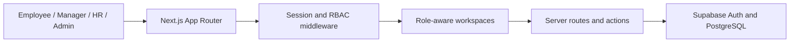

<div align="center">


# TimeDesk

### Smart attendance. Seamless workflow.

A role-based workforce platform for attendance, leave operations, organizational administration, and HR reporting.


</div>

---

## Overview

TimeDesk centralizes everyday workforce operations in a responsive web application. Employees can record attendance and manage leave, managers can supervise their teams, HR can coordinate organization-wide workflows, and administrators can control the system's operational structure.

The application combines a Next.js App Router frontend with authenticated server workflows, Supabase services, role-aware navigation, reporting, and an installable mobile experience.

## Role-Based Workspaces

| Workspace | Primary responsibilities |
| --- | --- |
| **Employee** | Attendance history, leave requests, balances, regularization, extra working days, profile, and team visibility |
| **Manager** | Team attendance oversight and leave-approval workflows |
| **HR** | Organization attendance, teams, approvals, and workforce reports |
| **Administrator** | Users, departments, hierarchy, teams, locations, policies, holidays, leave rules, reports, and system settings |

## Core Capabilities

- Daily attendance workflows with employee-level and organization-wide views
- Leave requests, approvals, balances, limits, resets, and configurable leave types
- Attendance regularization and extra-working-day requests
- Department, team, reporting hierarchy, office-location, and holiday management
- Policy publishing and organization settings
- Operational analytics, compliance reporting, and spreadsheet-ready reporting workflows
- Profile management with image upload and cropping
- Supabase authentication with server-side sessions and role-based access control
- Responsive application shell with an installable PWA experience

## Technology

| Layer | Technology |
| --- | --- |
| Application | Next.js 16, React 19, TypeScript |
| Interface | Tailwind CSS 4, Radix UI, shadcn/ui patterns, Lucide React |
| Data and authentication | Supabase, PostgreSQL, Supabase Auth, server-side sessions |
| Client state | Redux Toolkit, React Redux, React Hook Form, Zod |
| Reporting and visualization | Recharts, ExcelJS |
| Interaction | Framer Motion, Sonner, React Day Picker |

## Architecture



Privileged operations use server-only Supabase credentials. Client-side access is limited to public project configuration and authenticated session data.

## Project Structure

```text
TimeDesk/
├── public/                    Branding, favicon, manifest, and static assets
├── src/
│   ├── app/                   App Router pages, layouts, actions, and API routes
│   │   ├── admin/             Administrative workspace
│   │   ├── hr/                HR workspace
│   │   ├── manager/           Manager workspace
│   │   ├── employee/          Employee team views
│   │   ├── attendance/        User attendance details
│   │   ├── leaves/            Leave and regularization workflows
│   │   └── api/               Protected application endpoints
│   ├── components/            Application, dashboard, and UI components
│   ├── lib/                   Schemas, constants, and shared utilities
│   ├── state/                 Redux store and API integration
│   ├── types/                 Authentication and domain types
│   └── utils/                 Validation, RBAC, and Supabase clients
├── migration.sql              Core PostgreSQL schema
├── validation_constraints.sql Database validation rules
└── database_schema.md         Data-model documentation
```

## Local Development

### Requirements

- Node.js 20 or newer
- npm
- A Supabase project

### Setup

```bash
git clone https://github.com/rahultripathi17/TimeDesk.git
cd TimeDesk
npm install
```

Create `.env.local` in the repository root:

```env
NEXT_PUBLIC_SUPABASE_URL=your_supabase_project_url
NEXT_PUBLIC_SUPABASE_ANON_KEY=your_supabase_anon_key
SUPABASE_SERVICE_ROLE_KEY=your_server_only_service_role_key
NEXT_PUBLIC_APP_URL=http://localhost:3000
```

> Never expose `SUPABASE_SERVICE_ROLE_KEY` in client-side code or commit it to source control.

Apply [`migration.sql`](migration.sql) and [`validation_constraints.sql`](validation_constraints.sql) to the target Supabase database, then start the development server:

```bash
npm run dev
```

Open **http://localhost:3000**.

## Available Commands

| Command | Purpose |
| --- | --- |
| `npm run dev` | Start the Webpack development server |
| `npm run build` | Create a production build |
| `npm run start` | Run the production server |
| `npm run lint` | Run the project ESLint configuration |

## Security

- Local environment files and private keys are excluded through `.gitignore`.
- Administrative endpoints use server-side authorization and service credentials.
- Access is separated by employee, manager, HR, and administrator roles.
- Database validation constraints are maintained separately from the core migration.

## License

Copyright © 2025 Rahul Tripathi. This repository is proprietary and all rights are reserved. See [`LICENSE`](LICENSE) for usage restrictions.

---

<div align="center">

Built and maintained by <a href="https://github.com/rahultripathi17">Rahul Tripathi</a>

[](https://rahul-tripathi.web.app/)
[](https://www.linkedin.com/in/rahultripathi17/)

</div>
